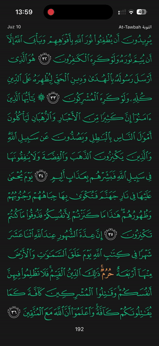
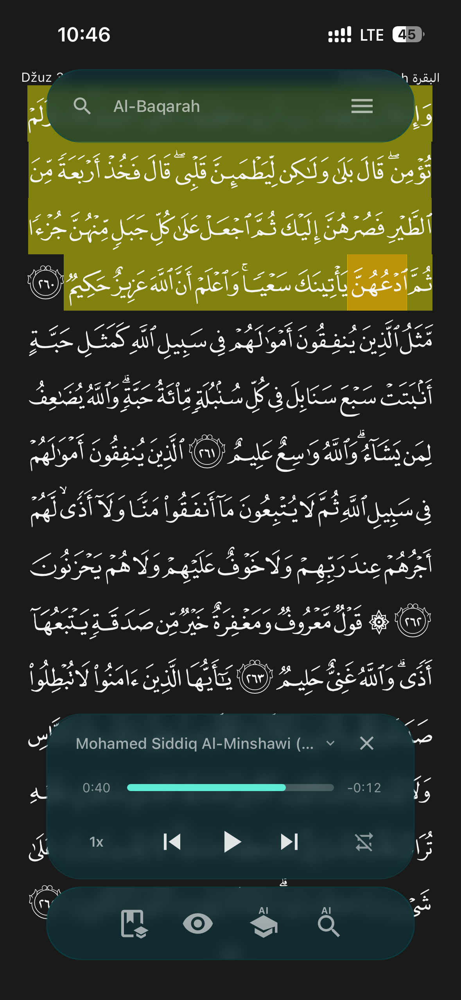
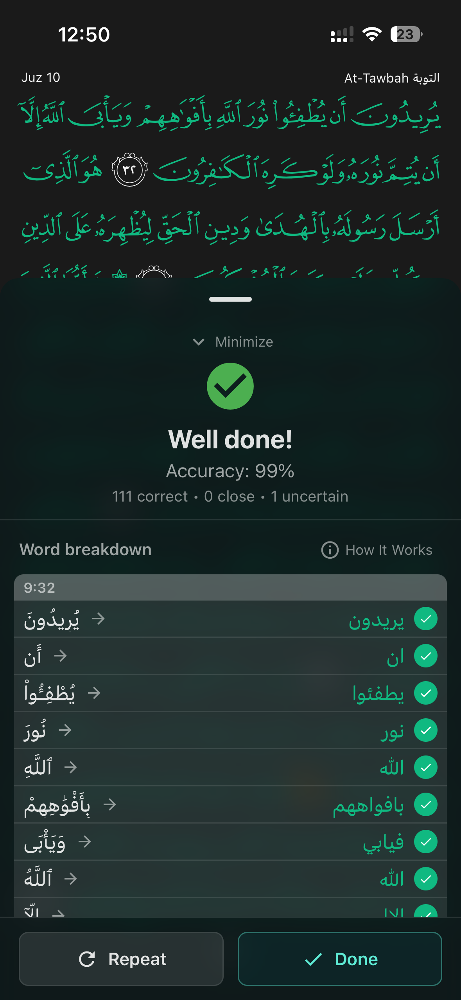
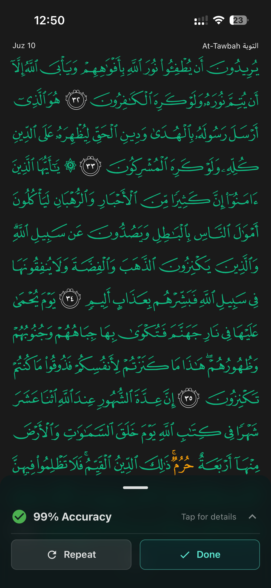
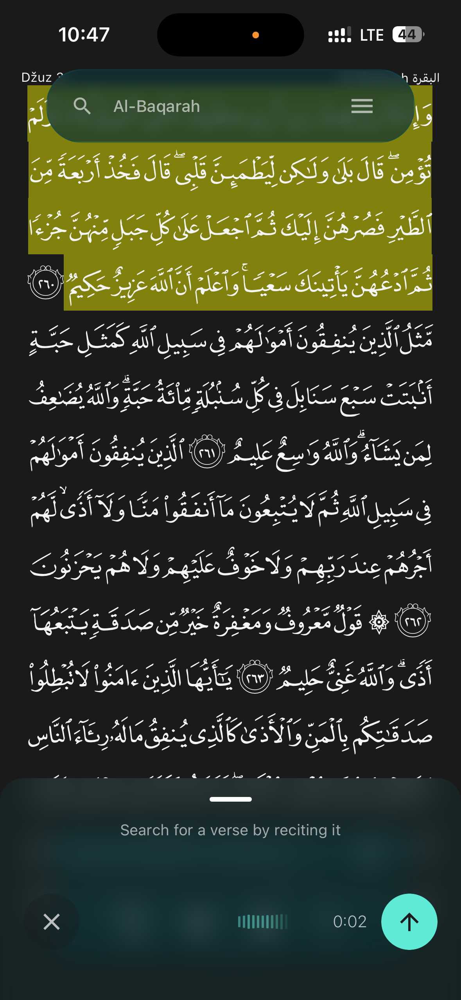
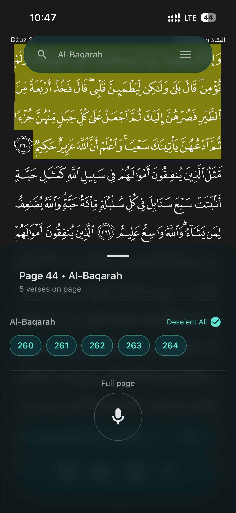
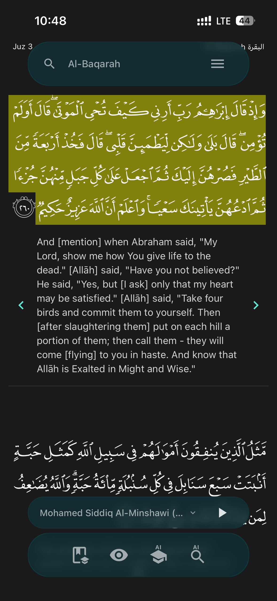
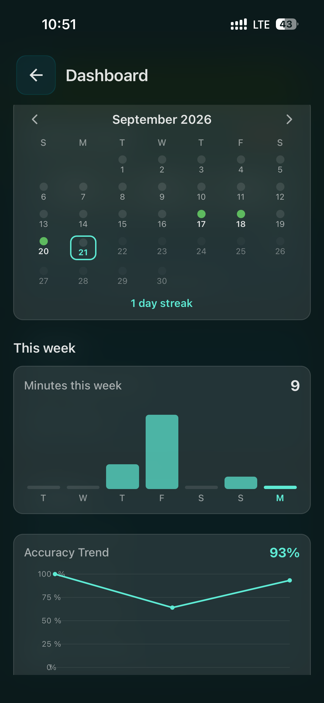
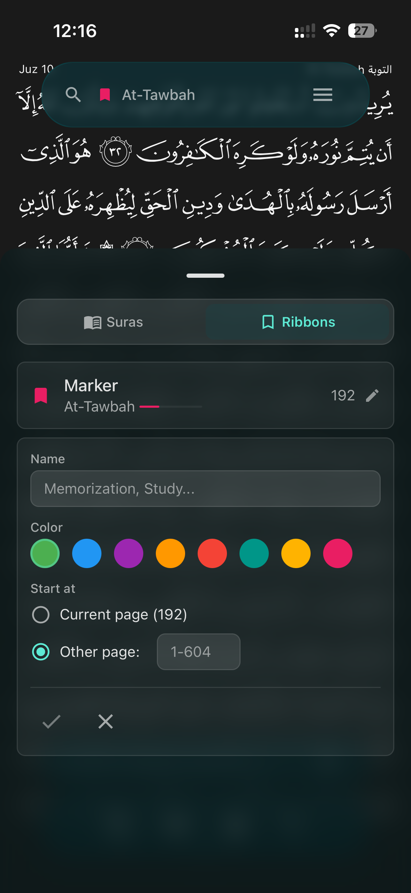

# Tilawi — Quran Reader & AI Memorization

**Read, listen, study, and memorize the Qur'an — with private, on-device AI feedback.**
No account. No ads. No tracking. Free.

[**tilawi.ai**](https://tilawi.ai) · [App Store](https://apps.apple.com/app/id6757377322) · [Google Play](https://play.google.com/store/apps/details?id=com.durako.tilawi)

---

## Private by design

- **On-device AI** — your recitation is transcribed and checked **entirely on your phone**. Your audio never leaves the device.
- **No account, no sign-up** — open the app and start reading.
- **No ads, no tracking, no analytics, no servers holding your data.**
- **Free, for everyone.**

## Features

- 📖 **Full muṣḥaf** — 604 pages, Uthmanic Hafs script, smooth right-to-left page navigation
- 🎧 **Audio** — 30+ reciters, background playback, word-by-word highlighting, range repeat, speed control
- 🔎 **Voice search** — find any verse just by reciting it
- 🎤 **Practice mode** — hide the text, recite, and get **on-device word-by-word accuracy feedback**
- 📚 **Study mode** — translations, transliteration, and tafseer
- 📊 **Progress dashboard** — streaks, minutes, accuracy trend, and a ḥifẓ map
- 🔖 **Bookmarks** and **4 languages** (English, Deutsch, Bosanski, العربية) with full RTL

## Demo

**Voice search:** recite any verse and Tilawi finds it almost instantly. The AI runs entirely on your phone, with no upload and no waiting on a server.

## Screenshots

| Reader + audio | AI feedback | Colored page | Voice search |
|:---:|:---:|:---:|:---:|
|  |  |  |  |

| Practice | Study | Dashboard | Bookmarks |
|:---:|:---:|:---:|:---:|
|  |  |  |  |

## How the AI feedback works

Tilawi listens to your recitation and compares it, word by word, against the fixed canonical Qur'an text — then colors each word by how confidently it matched:

- 🟢 **Green** — correct
- 🟠 **Amber** — uncertain
- 🔴 **Red** — incorrect
- 🟣 **Purple** — skipped
- ⚪ **Gray** — an extra word

The app never generates or alters Qur'an text; it only grades **your** recitation against it, on your device.

## Privacy & Support

- 🔒 **Privacy Policy:** [tilawi.ai/privacy](https://tilawi.ai/privacy)
- 📄 **Terms:** [tilawi.ai/terms](https://tilawi.ai/terms)
- ✉️ **Support:** support@tilawi.ai

---

Made with care for the Ummah. 🤲

